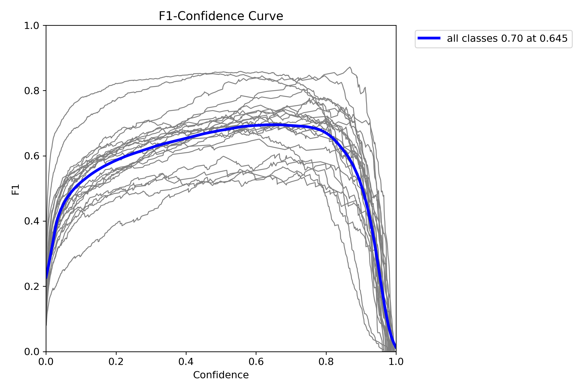
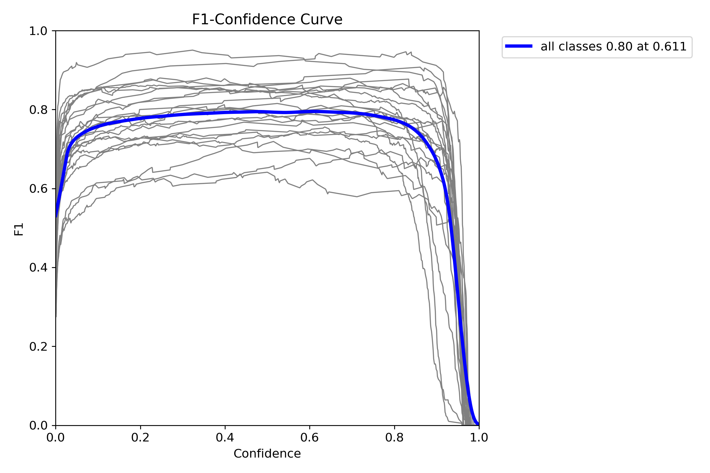

<h1 align=center>Outfit Of The Travel - AI API Server</h1>

<div align="center">
     
</div>

> OOTT(Outfit Of The Travel) 

Our service, OOTT, uses artificial intelligence to analyze the latest social media information to suggest outfits that take into account the latest trends for people who are worried about fashion in travel destinations. In addition, it recommends ultra-personalized outfits by considering information such as weather, user's taste, travel destination, travel purpose, and companions.

- Personalized outfit recommendations
- Trend-based recommendations
- Outfit sharing service
- My Closet
- Personalized shopping service

<a href="https://github.com/Outfit-of-the-Trip/OOTT-Android" target="_blank">

<h2 align=center>AI Architecture </h2>

<div align="center">
     
</div>


AI contributes to this project in two ways.
1. Recommendation algorithm that reflects fashion trends by analyzing photos in SNS with object detection AI
2. A system that recognizes camera images with object detection AI and stores the information in the user's closet DB.

To train an image recognition AI, we first collected and labeled clothing images from Google to build data. Then, we trained an object detection AI called Yolov8 and used it.

To further identify fashion trends by destination, we developed a crawler to collect data using Instagram's destination hashtags.

The crawler collected image data for each destination on Instagram every month, extracted the results with the Yolov8 AI, and applied the types, colors, and combinations of clothes to the recommendation algorithm.

In addition to the recommendation algorithm, we developed a system that uses Yolov8 AI to extract information from images sent to the server by the app and return them to identify and store the types of clothes in the image in the user's closet.


### API document
| Function | Method | End Point | Request Body | Response Body |
| --- | --- | --- | --- | --- |
| batch_predict | POST | /predict/batch | <pre>{<br>  "base64_images": [<br>    "string"<br>  ],<br>  "recommend_type": "string"<br>}</pre> | <pre>{<br>  "result": true<br>}</pre> |
| camera_predict | POST | /predict/camera | <pre>{<br>  "base64_image": "string"<br>}</pre> | <pre>{<br>  "label": "string",<br>  "color": "string"<br>}</pre> |


<h2 align=center>Detail 📑</h2>

### Why did we use compute resources separate from the main server?
Although it makes sense from an operational point of view to use the main server, node.js, AI server, fastapi, and auto-crawl server using cloud-based Kubernetes, we used independent servers due to issues related to operational costs.

### Why should we use the BASE MODEL (e.g. GroundedSAM, GroundingDino) to augment my data?

<div align="center">
     
</div>

1. There are limitations in labeling after data collection.

Since there was a cost limit to manually labeling data, we experimented with model training by assigning pseudo labels to sub data through the BASE model in addition to the main data collected and labeled.

2. Models such as GroundedSAM and GroundingDino show good performance but are difficult to apply to real-world services due to the large number of parameters. In addition, the two models mentioned above are prompt-based models and do not require additional training.

<div align="center">
     
</div>

In the case of BASE MODELS such as GroundedSAM and GroundingDino, they can output accurate results because they are huge models with a large number of hyperparameters.
However, due to the large number of hyperparameters, it takes a long time to output the results of the model, which is difficult to apply to actual services.
Therefore, we tried a strategy of using GroundedSAM and GroundingDino, which are huge models, to fake label the data, and then train Yolo v8 models, which have fewer hyperparameters and are faster and can be used as a service.

3. As a result, additional training with pseudo labels using the BASE MODEL performed poorly, so we trained and deployed the model using only the TARGET MODEL.

Since there are 24 classes in the dataset, it is assumed that inappropriate pseudo data was extracted because the base model did not accurately recognize it. Since then, the target model has trained with a strange dataset, so the performance seems to be poor.

<div align="center">
      
    
</div>

> Left figure: base model + target model <br/>
> Rigth figure: target model

### Why did you use Deep sparse to deploy your model?
<div align="center">
     
</div>

DeepSparse is a CPU inference runtime that takes advantage of sparsity within neural networks to execute inference quickly. So we adopted DeepSparse for smooth service delivery in a CPU-based server environment.

<div align="center">
     
</div>

---

<h2 align=center>Program 🚀</h2>

### Pre-requirements
1. Create ./config/secrets.yaml file
```yaml
# secrets.yaml
server:
  db:
    host: [MYSQL SERVER IP]
    port: [MYSQL SERVER PORT]
    user: [MYSQL USER]
    pw: [MYSQL PASSWORD]
    db: [MYSQL NAME]
    multipleStatements: True

trend_crawling:
  instagram_key:
    id: [INSTAGRAM ID]
    pw: [INSTAGRAM PASSWORD]
```

2. Install the module to run the program.
```bash
pip install ./requirements.txt
```

3. Install chrmoe for crawling (Following code is for linux.)
```bash
wget https://dl.google.com/linux/direct/google-chrome-stable_current_amd64.deb
sudo apt install ./google-chrome-stable_current_amd64.deb
```

4. If you want to train target model (Yolo v8), refer to sample.txt, sample.jpg in the `main_data` folder and transfer the data to the format.

5. If you want to create a pseudo label, check sample.txt, sample.jpg in the `sub_images` folder and transfer the data to the format.

### Trend Crawling
Change the hyperparameters of `./config/trend_crawling.yaml` and run them.
<details>
<summary>📔 About hyperparameters config</summary>

```yaml
### ./config/trend_crawling.yaml ###
debug: False # Options for debugging
secret_dir: ./config/secrets.yaml # Path to Secret file 
image_num: 25 # Number of images per category to be collected during crawling
save_dir: ./data/crawling_images # Path to saving crawling images
save_gcs: True # Save crawling images to Google Cloud Storage
serve_info: True # Request crawling results to AI servers
```
</details>

```bash
python3 ./trend_crawling.py --config ./config/trend_crawling.yaml
```

### Train Model (base / target)
Change the hyperparameters of `./config/base_model.yaml`, `./config/target_model.yaml` and run them.
<details>
<summary>📔 About hyperparameters config</summary>

```yaml
### ./config/base_model.yaml ###
model: GroundedSAM # Choose a large model for creating psudo labels. (eg. GroundedSAM, GroundingDino)
input_dir: ./data/sub_images # Path of data to generate psudo labels
output_dir: ./data/sub_data # Path to saving images and generated psudo labels
data_merge: True # Merges existing and psudo datasets
main_data_dir: ./data/main_data # Path to main data
merge_data_dir: ./data/augmented_data # Path of data to be merged
```
```yaml
### ./config/target_model.yaml ###
model: yolov8m # Choose from yolov8n, yolov8s, yolov8m, yolov8l and yolov8x
data_path: ./data/main_data/data.yaml # Paths of data to train the model
epochs: 1000 # Number of times to repeat the training
conver_to_onnx: True # Convert the model to the onnx form
```
</details>

```bash
python3 ./base_model.py --config ./config/base_model.yaml
python3 ./target_model.py --config ./config/target_model.yaml
```

### Run API Server
Change the hyperparameters of `./config/server.yaml` and run them.
<details>
<summary>📔 About hyperparameters config</summary>

```yaml
### ./config/server.yaml ###
secret_dir: ./config/secrets.yaml # Path to Secret file 
model:
  dir: ./runs/detect/train/weights/best.onnx # Path to trained model file
  iou_thres: 0.25 # IoU(Intersection of Union)
  conf_thres: 0.55 # Remove bounding boxes below confidence threshold.
info: # AI API Server config
  host: 0.0.0.0 
  port: 5543
  log_level: info
  workers: 1
```
</details>

```bash
python3 ./server.py --config ./config/server.yaml
```

If you want to deploy as a Docker container, you can use following code.
```bash
docker build -t $IMAGE_NAME:latest .
docker push $IMAGE_NAME:latest # Optional
docker pull $IMAGE_NAME:latest # Optional
docker run -d -p 5543:5543 --name oott $IMAGE_NAME:latest
```

<h2 align=center>Open Source 📖</h2>

| Program | Github |
| --- | --- |
| Ultralytics | https://github.com/ultralytics |
| Deepsparse | https://github.com/neuralmagic/ |
| Autodistill | https://github.com/autodistill/ |
| label-studio | https://github.com/HumanSignal/label-studio |

---

<h2 align=center>Author 👤</h2>

```yaml
Github: @jeirfe
Website: jerife.github.io
Email: jerife@naver.com

Copyright © 2023 jerife.
This project is Apache-2.0 licensed.
```